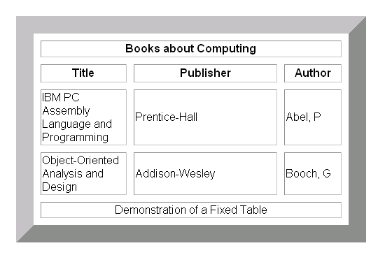

# Object-Oriented Programming, HTML Tables

)
### What a table in HTL: It is a representation of information displayed in a grid format that allows us to understand complex data by referencing information on two axes. Each block in the grid is called a table cell. In HTML a table is writen out row by row. Basic structure of a table:

1. Heading: The <> with “h” between them refer to the element whose purpose is to represent the heading to eother a column or row.
2. Column: The colspan attribute can be used on a “th” or “td” element to indicate how many columns that cell should run across.
3. Row: The rowspan attribute can be used by the “th” of”td” elements to indicate how many rows a cell should run across.
## There are long tables and short tables. Three elements are used to differentiate between the main content of the table and the first and last rows:

- Head: Sits inside the thead element
- Body: Sits inside the tbody element
- Foot: Sits inside the tfoot element
- Here is an example of a html table

## Functions allow you to group a set of related statements together that represent a single task. Tey can be used to take parameters to return a value of something. An object is a series of variables and functions that represent something. In an object variables are known as properties of the object. functions are known as methods of the object.

An example of a simple function is:

## function myMoney(200, 8000){ return 200 * 8000; // The function returns the product of 200 and 8000. }

Sample of a method is:

> console.log(‘Hello World”); // will prit Helo World in the console.

It is useful for testing purpose

Example of an object is: This object is created in literal notation form

> var clement = { height: 6ft, weight: 180lbs, hairColor: black; skinColor: dark; }

I can then add properties to it by using dot notation:

clement.father = true; clement.kids = 4;